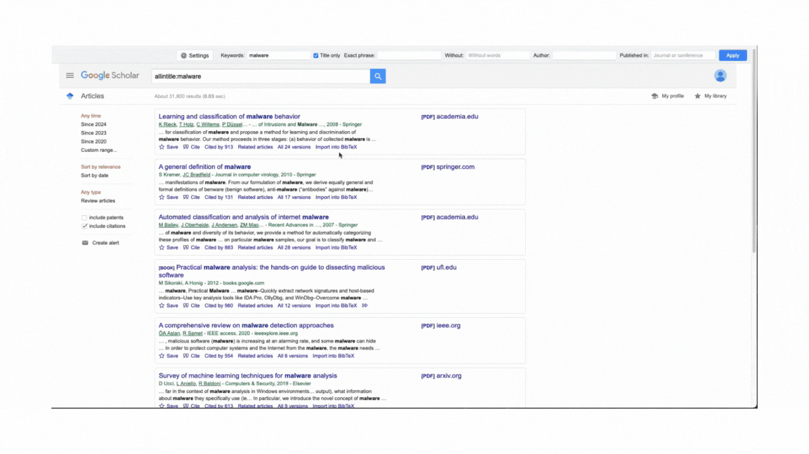

# Google Scholar Enhancer

[中文](README_zh.md)

**Google Scholar Enhancer** is a Tampermonkey user script that enhances the functionality of Google Scholar. It adds features such as column layout options, auto-paging, direct BibTeX copying, and more to improve your research experience.

## Features

- **Customizable Column Layout**: Choose between single, double, or triple column layouts for search results.
- **Auto-Paging**: Automatically load more results as you scroll down the page.
- **Direct BibTeX Copying**: Copy BibTeX citations directly to your clipboard with a single click.
- **Single Result Auto-Redirect**: Automatically redirect to the paper's page when there's only one search result.
- **Frequent Scholars Display**: Show a list of the most frequently appearing authors in your search results.
- **Advanced Search Interface**: Use an enhanced search interface for more precise queries.
- **Multilingual Support**: Switch between English and Chinese interfaces.

## Installation

1. Install the Tampermonkey extension for your browser:
   - [Chrome](https://chrome.google.com/webstore/detail/tampermonkey/dhdgffkkebhmkfjojejmpbldmpobfkfo)
   - [Firefox](https://addons.mozilla.org/en-US/firefox/addon/tampermonkey/)

2. Install the Google Scholar Enhancer script:
   - Visit the [GreasyFork page](https://greasyfork.org/zh-CN/scripts/511179-google-scholar-enhancer) for this script
   - Click on the "Install this script" button

   OR

   - Copy the entire script code
   - Open Tampermonkey in your browser and click "Create a new script"
   - Paste the code into the script editor
   - Click "File" > "Save"

## Usage

After installation, visit Google Scholar. You'll see new options and features:

- A settings button (⚙️) in the top-right corner to customize the script's behavior
- An advanced search interface at the top of the page
- Changes to the layout based on your column preference
- Auto-loading of more results as you scroll
- Direct BibTeX copying when clicking on BibTeX links
- A list of frequent scholars on the right side of the page (if enabled)

## Configuration

Click the settings button (⚙️) to open the configuration modal. Here you can:

- Change the column layout
- Toggle auto-paging
- Enable/disable direct BibTeX copying and alerts
- Toggle single result auto-redirect
- Show/hide frequent scholars
- Switch between English and Chinese interfaces

## Contributing

Contributions to improve Google Scholar Enhancer are welcome. Please feel free to submit pull requests or open issues on the GitHub repository.

## License

This project is licensed under the MIT License.