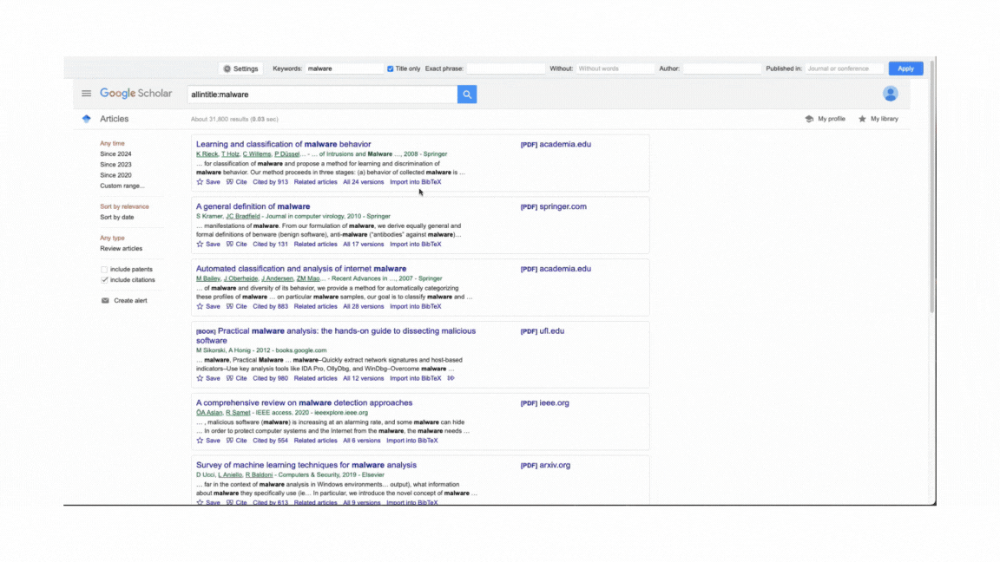

# Google Scholar 增强器

**Google Scholar 增强器**是一个 Tampermonkey 用户脚本，用于增强 Google Scholar 的功能。它添加了诸如列布局选项、自动翻页、直接 BibTeX 复制等功能，以改善您的研究体验。

## 功能

- **可自定义列布局**：为搜索结果选择单列、双列或三列布局。
- **自动翻页**：当您向下滚动页面时自动加载更多结果。
- **直接 BibTeX 复制**：单击即可直接将 BibTeX 引用复制到剪贴板。
- **单一结果自动重定向**：当只有一个搜索结果时自动重定向到论文页面。
- **常见学者显示**：显示搜索结果中最常出现的作者列表。
- **高级搜索界面**：使用增强的搜索界面进行更精确的查询。
- **多语言支持**：在英文和中文界面之间切换。

## 安装

1. 为您的浏览器安装 Tampermonkey 扩展：
   - [Chrome](https://chrome.google.com/webstore/detail/tampermonkey/dhdgffkkebhmkfjojejmpbldmpobfkfo)
   - [Firefox](https://addons.mozilla.org/zh-CN/firefox/addon/tampermonkey/)

2. 安装 Google Scholar 增强器脚本：
   - 访问此脚本的 [GreasyFork 页面](https://greasyfork.org/zh-CN/scripts/511179-google-scholar-enhancer)
   - 点击"安装此脚本"按钮

   或者

   - 复制整个脚本代码
   - 在浏览器中打开 Tampermonkey 并点击"创建新脚本"
   - 将代码粘贴到脚本编辑器中
   - 点击"文件" > "保存"

## 使用方法

安装后，访问 Google Scholar。您将看到新的选项和功能：

- 右上角的设置按钮 (⚙️)，用于自定义脚本行为
- 页面顶部的高级搜索界面
- 根据您的列偏好更改布局
- 滚动时自动加载更多结果
- 点击 BibTeX 链接时直接复制 BibTeX
- 页面右侧的常见学者列表（如果启用）

## 配置

点击设置按钮 (⚙️) 打开配置模态框。在这里您可以：

- 更改列布局
- 切换自动翻页
- 启用/禁用直接 BibTeX 复制和提醒
- 切换单一结果自动重定向
- 显示/隐藏常见学者
- 在英文和中文界面之间切换

## 贡献

欢迎为改进 Google Scholar 增强器做出贡献。请随时在 GitHub 仓库上提交拉取请求或开启问题。

## 许可证

本项目采用 MIT 许可证。

[English](README.md)